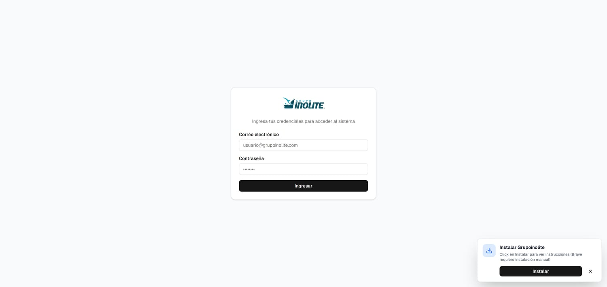
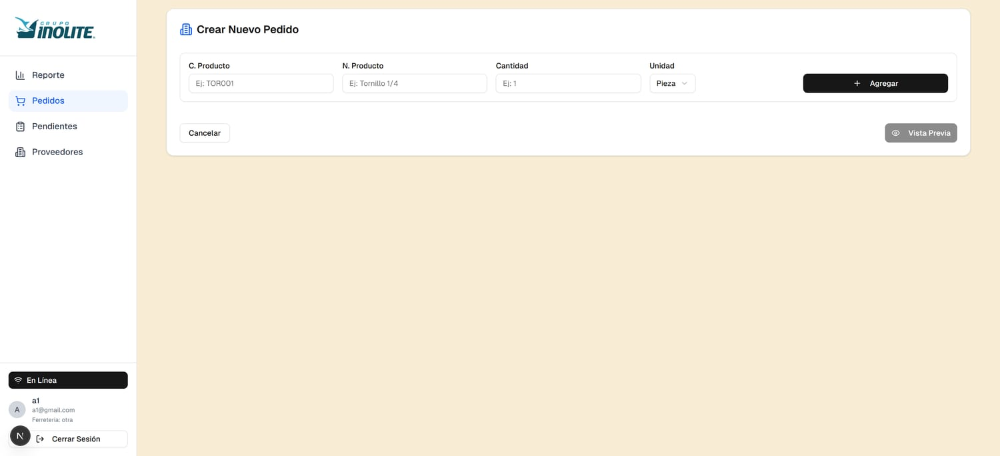
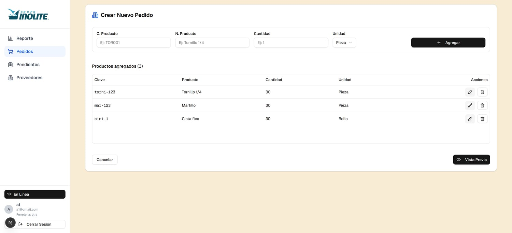
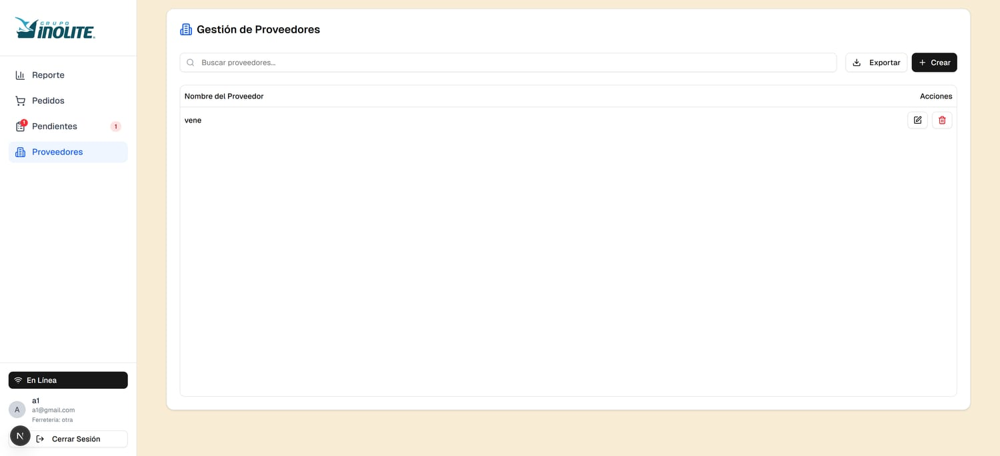

# Ferretería — App (demo)

Ambiente de **demostración** público del sistema de gestión de compras para una ferretería: crear órdenes de compra, administrar proveedores y sucursales, y enviar la orden al proveedor. **Next.js 15 + React 19**, PWA **offline-first**.

Build simplificada, separada del sistema en producción del cliente. El backend está en [`api-demo-ferreteria`](https://github.com/juan436/api-demo-ferreteria).

| Login | Órdenes de compra |
|---|---|
|  |  |

| Crear orden | Proveedores |
|---|---|
|  |  |

---

## Lo que define esta app: funciona sin conexión

Un encargado de compras en una bodega o un pasillo suele no tener señal. La app está construida para que eso no lo detenga:

- **`lib/indexeddb.ts`** — el dato de trabajo vive en IndexedDB en el navegador (5 stores).
- **`lib/sync-service.ts`** — singleton que detecta conectividad real (ping, no solo el evento del navegador), mantiene una **cola priorizada por entidad y tipo de operación**, y resuelve los **IDs temporales** generados offline por los IDs reales cuando el servidor responde.
- **`public/sw.js`** — service worker con estrategia *Network First*, excluye `/api/`.
- **`components/offline/`** y **`components/pwa/`** — indicador de estado, toggle de modo offline y prompt de instalación.

Crear un pedido o un proveedor sin conexión funciona igual que online; al recuperar señal, la cola se vacía en orden.

---

## Stack

| Área | Tecnología |
|---|---|
| Framework | Next.js 15 (App Router), React 19, TypeScript |
| UI | Tailwind CSS, Radix UI / shadcn, Lucide, `recharts` |
| Formularios | React Hook Form + Zod |
| Export | `exceljs` (órdenes a Excel con estilos) |
| Offline | IndexedDB + service worker + cola de sync propia |

---

## Estructura

```
app/
  login/  dashboard/  dashboard/users/     # el dashboard renderiza según activeSection en contexto
components/
  purchases/{order,provider,report}         # módulos de negocio (sin recepción parcial ni pendientes)
  admin/  views/  navigation/  layout/
  offline/  pwa/  notifications/  form/  ui/  context/  providers/
lib/          indexeddb · sync-service · api-client · api-config · storage-helper
services/     auth · order · provider · branch · user · notification · validation
hooks/  interfaces/  types/  utils/
```

Respecto al sistema en producción del cliente, esta build **no** incluye el flujo de recepción parcial de mercancía ni el módulo de pedidos pendientes — es una snapshot anterior y más simple.

---

## Correr en local

Requisitos: Node 20, pnpm.

```bash
pnpm install
cp env.example .env.local          # completar NEXT_PUBLIC_API_URL
pnpm dev                            # http://localhost:3000
```

### Variables de entorno

| Variable | Descripción |
|---|---|
| `NEXT_PUBLIC_API_URL` | Base de la API (`api-demo-ferreteria`) |
| `NODE_ENV` | `development` / `production` |

---

## Despliegue

Se empaqueta con el `Dockerfile` incluido (multi-stage, Node 20, pnpm vía corepack, `output: standalone`, usuario no-root, healthcheck) y corre como contenedor detrás de un reverse proxy con TLS.

```bash
docker build -t ferreteria-demo .
docker run -p 3000:3000 --env-file .env ferreteria-demo
```

---

## Forma de trabajo

- Commits en Conventional Commits (`feat:`, `fix:`, `chore:`, `build:`, `refactor:`). Rama `main`.
- Dependencias pinneadas; instalación con lockfile congelado y `ignore-scripts` en el build.
- Ambiente de demo mantenido por separado del repo en producción del cliente — mismo linaje de código.

---

## Licencia

Apache 2.0 — ver [`LICENSE`](./LICENSE). Cualquier modificación o uso debe preservar el aviso de copyright original:

```
Copyright (c) 2025 Juan Villegas <juancvillefer@gmail.com>
```

## Contacto

Juan Villegas — [juancvillefer@gmail.com](mailto:juancvillefer@gmail.com)
